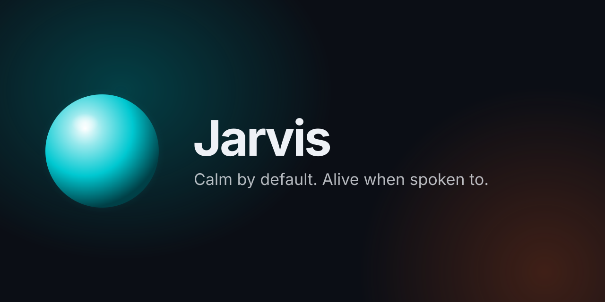

<h1 align="center">Jarvis</h1>

<p align="center"><b>Say "Jarvis", ask for anything, and get it done.</b><br/>
Your voice assistant for Mac, Windows and Linux — it uses the AI subscriptions you already pay for,<br/>
and nothing risky happens without your OK.</p>

<p align="center">
  <a href="https://github.com/lopadova/jarvis-desktop/releases/latest"></a>
  <a href="#quickstarts"></a>
  <a href="docs/guides/getting-started.md"></a>
</p>

<p align="center">
  <a href="LICENSE"></a>
  <a href="https://github.com/lopadova/jarvis-desktop/actions/workflows/ci.yml"></a>
  <a href="https://github.com/lopadova/jarvis-desktop/releases"></a>
  <a href="https://github.com/lopadova/jarvis-desktop/stargazers"></a>
  <a href="#install"></a>
  <a href="https://v2.tauri.app"></a>
  <a href="https://www.typescriptlang.org"></a>
  <a href="CONTRIBUTING.md"></a>
</p>

<p align="center">
  <a href="docs/guides/brains.md#chatgpt-plan--sign-in-with-chatgpt"></a>
  <a href="docs/guides/brains.md"></a>
  <a href="docs/guides/brains.md"></a>
  <a href="docs/guides/cowork-claude-desktop.md"></a>
  <a href="docs/guides/chatgpt.md"></a>
  <a href="docs/guides/voices.md"></a>
</p>

<p align="center">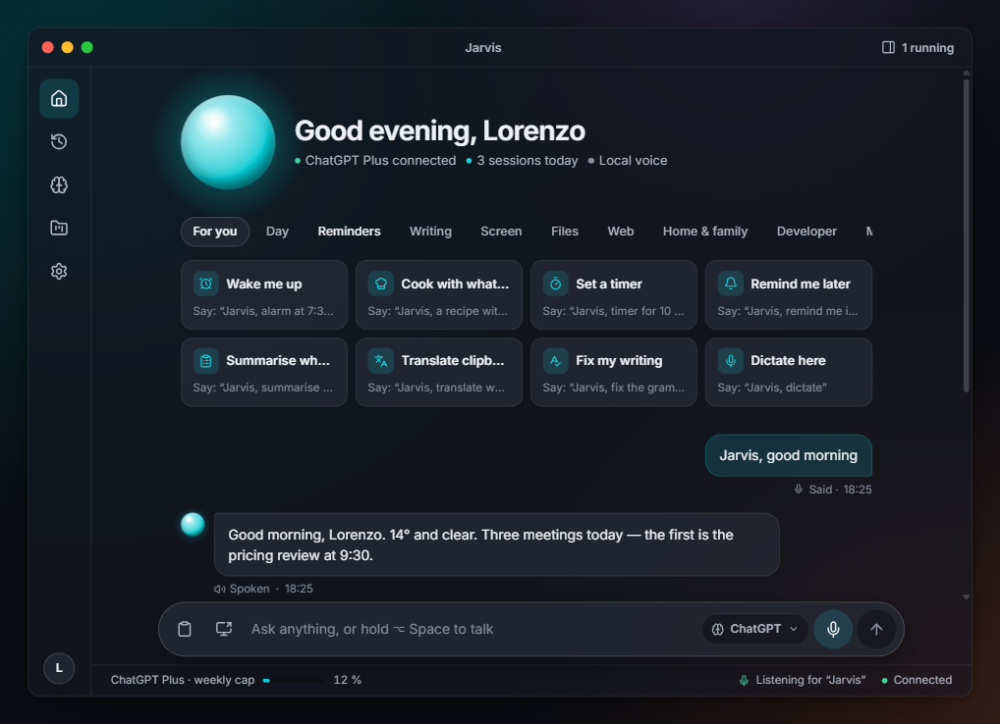</p>

Jarvis is a small assistant that lives next to your clock. You talk to it like you would to a helpful colleague: it answers quick questions out loud, sets timers and reminders, tidies up what you copied, and hands bigger jobs to a background helper that keeps you posted. It works with ChatGPT, Claude or a model running on your own computer, and it **always asks before doing anything that could cause trouble**.

> [!NOTE]
> **Status: v0.1.2 is out as a pre-release.** Installers are **unsigned** for now — see [Install](#install) for the one-time "open anyway" step. The design lives in the [product spec](docs/product-spec.md); what's next is in the [Roadmap](ROADMAP.md). If something doesn't work on your computer, please [open an issue](https://github.com/lopadova/jarvis-desktop/issues/new/choose) — early feedback shapes the next release.

### ⚡ Start in 60 seconds — pick your path

| I'm… | Do this |
|---|---|
| 🙋 **Not technical** | Paste `https://github.com/lopadova/jarvis-desktop — install Jarvis for me, step by step.` into **ChatGPT or Claude**. It follows [`INSTALL_WITH_AI.md`](INSTALL_WITH_AI.md) and walks you through every click. [More →](#a-home-user-no-terminal-needed) |
| 💳 **A ChatGPT / Claude / Codex subscriber** | Install, then **Continue with ChatGPT** or **Use Claude Code** — no API key, no surprise bill. [ChatGPT](#b-with-a-chatgpt-plus-or-pro-plan) · [Claude Code](#c-with-a-claude-code-subscription) · [Codex](#d-with-codex) |
| 🔒 **Privacy-first** | Run everything locally: Ollama + local Whisper + Piper voice. Nothing leaves your computer. [How →](#e-without-any-subscription) |
| 🔌 **Using Claude Desktop / Cowork or ChatGPT already** | Add Jarvis as an extension so your agents can speak to you and start tasks. [Claude](#f-use-jarvis-from-claude-desktop-or-cowork) · [ChatGPT](#g-use-jarvis-from-chatgpt) |
| 🛠️ **A developer** | `pnpm install && pnpm dev`. [Build from source →](#h-developers-build-from-source) |

---

## What can it do for you?

Click a suggestion on the Home screen or just say it. Every chip in the app has a spoken equivalent:

| | Feature | Just say… |
|---|---|---|
| 🌅 | **Morning briefing** — weather, today's calendar, important mail | "Jarvis, good morning" |
| ⏱️ | **Timers, alarms, reminders** — instant, offline, no AI needed | "Jarvis, remind me in 20 minutes to call Marco" |
| 📋 | **Summarise, translate or fix what you copied** | "Jarvis, translate what I copied into English" |
| ⌨️ | **Dictation** into whatever app you're using | "Jarvis, dictate" |
| 👀 | **"What's on my screen?"** — explain an error, a chart, a form (opt-in) | "Jarvis, explain this error" |
| 📁 | **Find files** and tidy folders | "Jarvis, find the September electricity bill PDF" |
| 🌐 | **Web research** and comparisons, done in the background | "Jarvis, look up reviews of the latest Pixel" |
| 🛒 | **Shopping list**, weather, recipes with what's in the fridge | "Jarvis, add milk to the shopping list" |
| 🧠 | **Memory** — it remembers what you teach it, and you can see and edit everything | "Jarvis, remember that I prefer short answers" |
| 🔒 | **Private / local mode** — nothing leaves your computer | "Jarvis, switch to local mode" |
| 🛠️ | **Developers:** drive Claude Code and Codex hands-free across projects | "Jarvis, in project shop add a footer" |

Italian works too: *"Jarvis, ricordami tra 20 minuti di chiamare Marco"*. The full phrasebook is in [Everyday features](docs/guides/everyday.md) and [Voice commands](docs/reference/voice-commands.md).

### See it

| Home: suggestions you can click or say | Asking before anything risky |
|---|---|
|  | 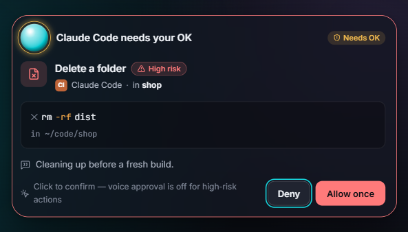 |
| **Background work, live** | **Pick the brain you already pay for** |
| 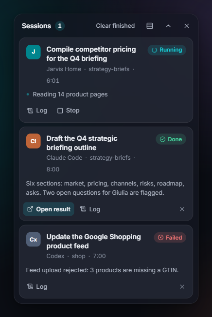 | 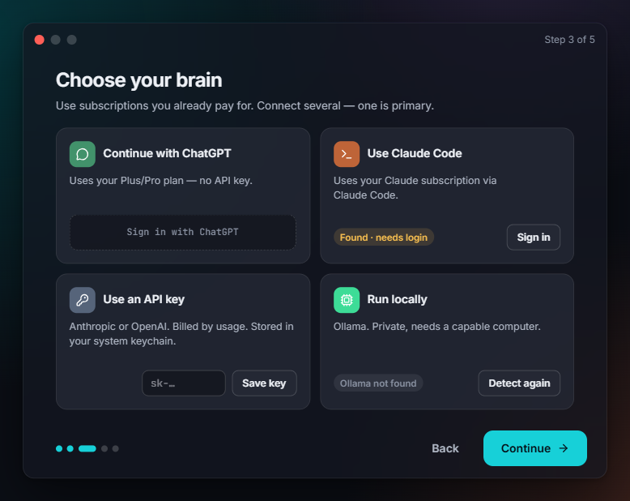 |

| Listening | Thinking | Speaking |
|---|---|---|
| 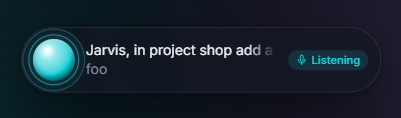 | 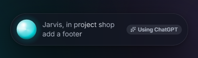 | 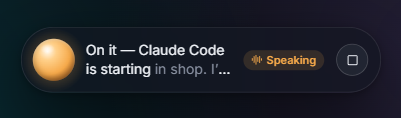 |

**The real app, running on Windows 11** (captured in Windows Sandbox, light theme):

| First run | Choose your brain | Home, connected to the assistant |
|---|---|---|
| 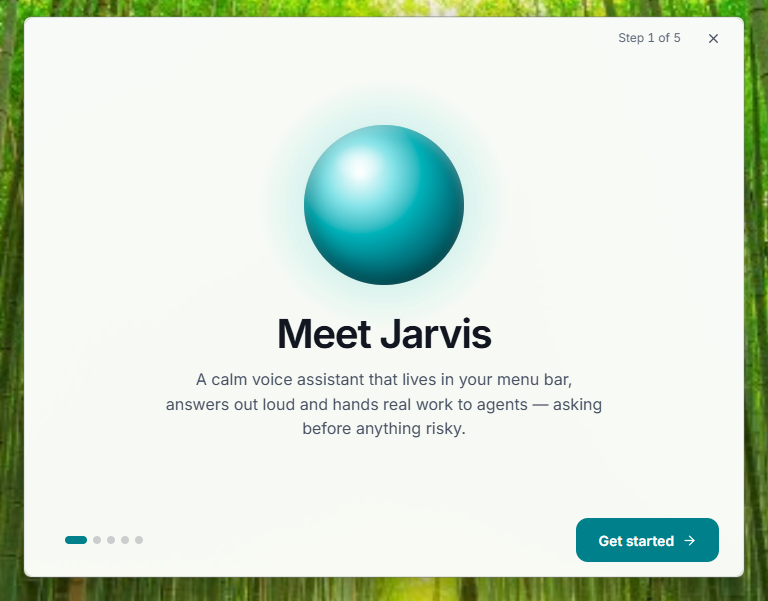 | 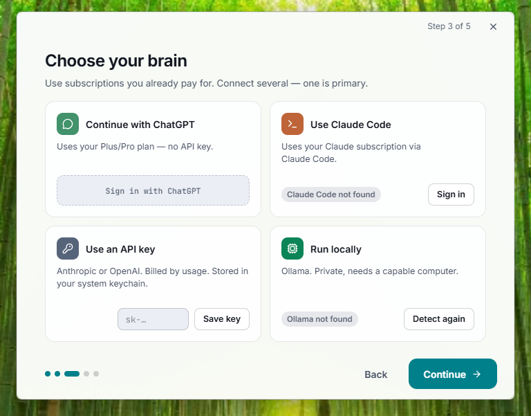 | 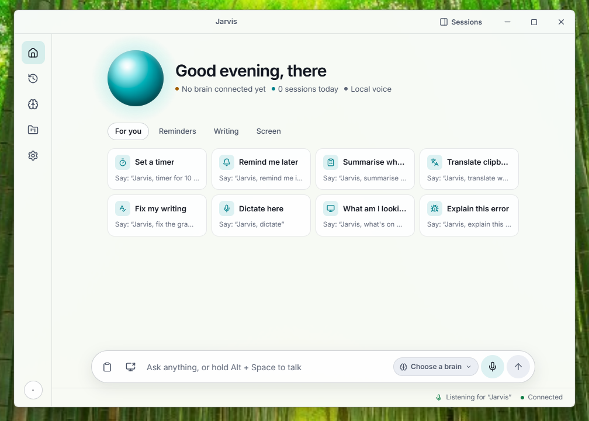 |

Light theme, Italian UI and per-project permission levels: [Home (light)](resources/screenshots/home-light.png) · [Home in Italian](resources/screenshots/home-it-dark.png) · [Settings › Agents & projects](resources/screenshots/settings-agents-dark.png).

---

## Table of contents

- [Start in 60 seconds](#-start-in-60-seconds--pick-your-path)
- [What can it do for you?](#what-can-it-do-for-you)
  - [See it (screenshots)](#see-it)
- [Why Jarvis is different](#why-jarvis-is-different)
- [How it compares](#how-it-compares)
  - [Built to be trusted](#built-to-be-trusted)
- [Install](#install)
- [Quickstarts](#quickstarts)
  - [a. Home user](#a-home-user-no-terminal-needed)
  - [b. ChatGPT Plus / Pro](#b-with-a-chatgpt-plus-or-pro-plan)
  - [c. Claude Code subscription](#c-with-a-claude-code-subscription)
  - [d. Codex](#d-with-codex)
  - [e. No subscription: API keys or fully local](#e-without-any-subscription)
  - [f. Use Jarvis from Claude Desktop / Cowork](#f-use-jarvis-from-claude-desktop-or-cowork)
  - [g. Use Jarvis from ChatGPT](#g-use-jarvis-from-chatgpt)
  - [h. Developers: build from source](#h-developers-build-from-source)
- [Examples gallery](#examples-gallery)
- [How it works](#how-it-works)
- [Security model](#security-model)
- [Privacy](#privacy)
- [Configuration](#configuration)
- [FAQ](#faq)
- [Roadmap](#roadmap)
- [Contributing](#contributing)
- [License](#license)
- [Acknowledgements](#acknowledgements)

---

## Why Jarvis is different

**💳 It runs on the subscriptions you already have.**
Sign in with your **ChatGPT Plus/Pro** plan (no API key), or use your **Claude Code** or **Codex** login. No surprise API bills: you set a weekly cap for Jarvis in your ChatGPT account, and when a cap is reached Jarvis tells you — it **never silently switches to a pay-per-use API**.

**🛡️ Safe by default.** Background agents ask Jarvis before running commands, deleting files or sending data out. Low-risk requests can be approved by voice ("yes"); **high-risk ones need a click**, and "always allow" is never offered for them. Links and web pages can't trigger actions. See [Security model](#security-model).

**🎙️ Your microphone stays yours.** The wake word and speech recognition (Whisper) run **on your computer**. Audio is sent to a cloud service only if you choose a cloud speech provider, and only after a command is captured. A visible indicator shows when the mic is live.

**🔌 Works where you already work.** Install the Jarvis extension in **Claude Desktop / Cowork**, connect it to **ChatGPT** through a free relay you deploy in one click, or add it as an MCP server to Claude Code and Codex. Your agents can then speak to you, ask you questions out loud and start tasks on your computer.

**🗣️ Many voices.** ElevenLabs (including expressive v3 tags such as `[happy]` or `[sigh]`), Fish Audio, OpenAI, local Kokoro/Piper, or your system voice.

**🪶 Tiny and cross-platform.** A Tauri 2 app: roughly 10–15 MB installers and a target of under 80 MB of memory while idle, on macOS, Windows and Linux.

**🔓 Open source (MIT).** Read the code, audit the security rules (each has an automated test), and make it yours.

---

## How it compares

A fair comparison against general categories of tools, not specific products.

| Capability | **Jarvis** | Built-in OS assistants | Chat apps | CLI-only coding agents |
|---|:---:|:---:|:---:|:---:|
| Hands-free wake word on desktop | ✅ | ✅ | ➖ | ❌ |
| Uses the AI subscription you already pay for | ✅ | ❌ | ✅ | ✅ |
| Choose your model provider (or run fully local) | ✅ | ❌ | ❌ | ➖ |
| Runs long background tasks and narrates progress | ✅ | ❌ | ➖ | ✅ |
| Drives Claude Code **and** Codex by voice | ✅ | ❌ | ❌ | ❌ |
| Voice/click approvals with risk tiers | ✅ | ➖ | ➖ | ➖ |
| Usable from inside Claude Desktop / ChatGPT via MCP | ✅ | ❌ | ➖ | ➖ |
| Same app on macOS, Windows and Linux | ✅ | ❌ | ✅ | ✅ |
| Open source | ✅ | ❌ | ❌ | ➖ |

> Legend: ✅ built-in · ➖ partial, depends on the product or needs extra setup · ❌ not available.

### Built to be trusted

| | |
|---|---|
| 🧪 **600+ automated tests** | across the core, providers, assistant process, MCP bridge, relay and UI — plus end-to-end runs of the real assistant process with the real MCP bridge and the real relay |
| 🛡️ **Every security rule has a test** | 12 written rules ([security model](docs/security-model.md)) from "links can't run commands" to "agents can't escalate their own permissions", each pinned by regression tests |
| 🔍 **Reviewed continuously** | every change went through an automated security review; the findings (and the fixes) are in the history |
| 🧰 **Boring, auditable stack** | Tauri 2, TypeScript, SQLite, official SDKs — no telemetry, secrets only in your OS keychain |

---

## Install

Download from **[GitHub Releases](https://github.com/lopadova/jarvis-desktop/releases/latest)**. v0.1.2 is a **pre-release**:

| Your computer | File | Tested |
|---|---|---|
| Windows 10/11 | `Jarvis_0.1.2_x64-setup.exe` (or the `.msi`) | Real Windows 11 |
| Mac with Apple chip | `Jarvis_0.1.2_aarch64.dmg` | Built by CI only |
| Mac with Intel chip | `Jarvis_0.1.2_x64.dmg` | Built by CI only |
| Linux (any) | `Jarvis_0.1.2_amd64.AppImage` | Built by CI only |
| Debian / Ubuntu | `Jarvis_0.1.2_amd64.deb` | Built by CI only |
| Fedora / openSUSE | `Jarvis-0.1.2-1.x86_64.rpm` | Built by CI only |
| Claude Desktop / Cowork | `jarvis.mcpb` (double-click) | Real Claude |
| Any MCP client | `jarvis-mcp-bundle.zip` | Real Claude Code |

Compare your download with `SHA256SUMS.txt`. Prefer to run from source? See [docs/guides/install.md](docs/guides/install.md).

> [!IMPORTANT]
> **v0.1 builds are not code-signed** (signing certificates cost money; see the [Roadmap](ROADMAP.md)). The first time you open Jarvis:
> - **macOS:** right-click Jarvis in Applications › **Open** › **Open**. Or *System Settings › Privacy & Security › Open Anyway*.
> - **Windows:** on the SmartScreen dialog click **More info** › **Run anyway**.
> - **Windows with Smart App Control on:** Windows may refuse unsigned programs outright ("an application control policy blocked this file"). Either wait for the signed build, run from source, or turn Smart App Control off (this cannot be undone without reinstalling Windows).
> - **Linux:** `chmod +x Jarvis_*.AppImage` and run it, or `sudo apt install ./Jarvis_<version>_amd64.deb`.

Full per-OS instructions: [docs/guides/install.md](docs/guides/install.md).

---

## Quickstarts

### a. Home user (no terminal needed)

1. Download the installer for your computer from [Releases](https://github.com/lopadova/jarvis-desktop/releases/latest) and open it (see the note in [Install](#install)).
2. Follow the 5-step welcome: **Welcome → Microphone → Choose your brain → Voice → Try it**.
3. Say **"Jarvis, what time is it?"**

**Prefer a helping hand?** Paste this repository link into ChatGPT or Claude and say:

```text
https://github.com/lopadova/jarvis-desktop — install Jarvis for me, step by step.
```

The assistant will follow [`INSTALL_WITH_AI.md`](INSTALL_WITH_AI.md), a guide written for AI helpers that walks you through each click and asks before anything important.

<details>
<summary><b>📋 Copy-paste prompts for ChatGPT or Claude</b> (open for ready-made messages)</summary>

**Install Jarvis on my computer**
```text
Read https://github.com/lopadova/jarvis-desktop/blob/main/INSTALL_WITH_AI.md and help me install Jarvis on my
computer. I am not technical: tell me which computer you think I have, ask me before every step, and give me
one small step at a time.
```

**Connect Jarvis to my ChatGPT plan** (no API key)
```text
I installed Jarvis (https://github.com/lopadova/jarvis-desktop). Explain, in simple steps, how to use
"Continue with ChatGPT" in Jarvis so it runs on my ChatGPT Plus/Pro plan, how to set a weekly usage cap for it
in ChatGPT, and what to do when the cap is reached.
```

**Let ChatGPT talk to Jarvis** (advanced)
```text
Using https://github.com/lopadova/jarvis-desktop/blob/main/docs/guides/chatgpt.md, guide me through deploying the
free Cloudflare relay for Jarvis and adding it as a custom connector in ChatGPT. Explain each step and warn me
about anything that costs money or needs a paid ChatGPT plan.
```

**I'm in Italian** — *"Leggi https://github.com/lopadova/jarvis-desktop/blob/main/INSTALL_WITH_AI.md e aiutami a installare Jarvis sul mio computer, un passo alla volta, chiedendomi conferma prima di ogni passaggio."*

</details>

<details>
<summary><b>🧑‍💻 First time with a terminal?</b> (junior-friendly walkthrough to build it yourself)</summary>

You only need this if you want to run Jarvis from the source code. Everyone else: use the installer above.

1. **Install the tools** (once): [Node.js 22+](https://nodejs.org), [Git](https://git-scm.com), [Rust](https://rustup.rs) and [Bun](https://bun.sh). On Windows also install the **"Desktop development with C++"** workload of [Visual Studio Build Tools](https://visualstudio.microsoft.com/downloads/); on Linux see the [Tauri prerequisites](https://v2.tauri.app/start/prerequisites/).
2. **Open a terminal** — Windows: *Windows Terminal* or PowerShell; macOS: *Terminal*; Linux: your terminal app.
3. **Copy these lines one at a time** (press Enter after each):

   ```bash
   git clone https://github.com/lopadova/jarvis-desktop.git   # downloads the code
   cd jarvis-desktop                                          # goes into the folder
   corepack enable                                            # enables pnpm, the package manager
   pnpm install                                               # downloads the libraries (a few minutes)
   pnpm sidecar:build                                         # builds the background assistant
   pnpm dev                                                   # starts Jarvis
   ```
4. A Jarvis window appears and an icon shows up next to your clock. Follow the welcome screens.
5. **Something went wrong?** Run `pnpm test` to check your setup, then read [Troubleshooting](docs/guides/troubleshooting.md) or ask in an [issue](https://github.com/lopadova/jarvis-desktop/issues/new/choose) (paste the error text).

> **Windows note:** if Smart App Control blocks the build tools ("an app control policy blocked this file"), see the [signing guide](docs/guides/signing.md#testing-unsigned-builds-locally) for a Docker/Sandbox route.

</details>

### b. With a ChatGPT Plus or Pro plan

1. In the welcome screen (or *Settings › Brain & accounts*) click **Continue with ChatGPT**.
2. Sign in in your browser and approve Jarvis. You can set a **weekly cap** for Jarvis in your ChatGPT account.
3. Done — no API key. Jarvis uses your plan for **text** (understanding and answering). Plan usage does **not** cover audio, so pick a voice provider in step 4 (a local or system voice is free).

Details and limits: [Brains › ChatGPT plan](docs/guides/brains.md#chatgpt-plan--sign-in-with-chatgpt).

### c. With a Claude Code subscription

```bash
npm install -g @anthropic-ai/claude-code   # if you don't have it yet
claude                                     # sign in once with your Claude account
```

Then in Jarvis choose **Use Claude Code**. Jarvis detects the CLI and uses your subscription both as a brain and as a background agent (through the Claude Agent SDK). Your plan's own usage limits apply.

### d. With Codex

```bash
npm install -g @openai/codex   # if you don't have it yet
codex login                    # sign in with your ChatGPT account or an API key
```

Then in *Settings › Brain & accounts* pick **Codex**. Say *"Jarvis, do the same with Codex"* to send a task to Codex instead of Claude.

### e. Without any subscription

- **API keys:** *Settings › Brain & accounts › Use an API key* — Anthropic or OpenAI. Keys are stored in your OS keychain, never in files. Defaults: `claude-haiku-4-5` / `gpt-5-mini` for quick routing.
- **Fully local:** install [Ollama](https://ollama.com), then:

  ```bash
  ollama pull llama3.2
  ```

  Choose **Run locally** (default endpoint `http://127.0.0.1:11434/v1`), pick **Piper** as the voice (downloaded on demand; Kokoro is an optional, English-only alternative) and keep **local Whisper** for speech. Say *"Jarvis, switch to local mode"* — the orb gets a green ring and nothing leaves your computer.

### f. Use Jarvis from Claude Desktop or Cowork

- **Claude Desktop:** download `jarvis.mcpb` from [Releases](https://github.com/lopadova/jarvis-desktop/releases/latest) (the in-app **Install extension** button is coming soon) and open it with Claude Desktop.
- **Cowork / Claude Code plugin** (skill + MCP server):

  ```text
  /plugin marketplace add lopadova/jarvis-desktop
  /plugin install jarvis@jarvis-desktop
  ```

Now Claude can say things out loud (`jarvis_speak`), ask you a question and wait for your answer (`jarvis_ask_user`), or start a task on your computer (`jarvis_start_task`). Keep Jarvis running. Guide: [Claude Desktop & Cowork](docs/guides/cowork-claude-desktop.md).

### g. Use Jarvis from ChatGPT

ChatGPT can only reach **remote HTTPS** MCP servers, and Jarvis never opens inbound ports on your computer. So you deploy a tiny relay (free tier) that your desktop connects to:

[](https://deploy.workers.cloudflare.com/?url=https://github.com/lopadova/jarvis-desktop/tree/main/packages/relay)

1. Click **Deploy to Cloudflare** (or `cd packages/relay && pnpm install && pnpm exec wrangler deploy`).
2. In Jarvis: *Settings › Integrations › ChatGPT* → paste your relay URL → you get a **pairing code** and QR code.
3. In ChatGPT, add a custom connector pointing to `https://<your-worker>.<your-account>.workers.dev/mcp` and enter the pairing code when asked.

Only read-only tools are exposed by default; every relayed call shows up on your desktop and risky ones still need a local click. Alternative: **Cloudflare Tunnel** (no code). A Vercel long-poll relay is included too, but the desktop client for it is not ready in v0.1. Custom connector availability depends on your ChatGPT plan — check the current OpenAI documentation. Guide: [ChatGPT](docs/guides/chatgpt.md).

### h. Developers: build from source

Prerequisites: Node.js ≥ 22, pnpm (via `corepack enable`), Rust stable, [Bun](https://bun.sh), and the [Tauri 2 prerequisites](https://v2.tauri.app/start/prerequisites/) for your OS.

```bash
git clone https://github.com/lopadova/jarvis-desktop.git
cd jarvis-desktop
corepack enable
pnpm install
pnpm sidecar:build   # compiles the TypeScript sidecar with Bun
pnpm dev             # runs the Tauri app in development mode
```

Checks: `pnpm lint`, `pnpm typecheck`, `pnpm test`, and `cargo test` in `apps/desktop/src-tauri`. Full setup: [docs/contributing/dev-setup.md](docs/contributing/dev-setup.md).

---

## Examples gallery

| Who | You say | Jarvis… |
|---|---|---|
| Parent, 7:45 am | "Jarvis, good morning" | reads the weather, your first two meetings and anything urgent in your inbox |
| Cook | "Jarvis, timer for 12 minutes for the pasta" | starts a local timer instantly — no AI call, works offline |
| Student | "Jarvis, summarise what I copied in five bullet points" | summarises the article on your clipboard and shows it in the Home window |
| Freelancer | "Jarvis, fix the grammar of what I copied" | returns a corrected version ready to paste |
| Traveller | "Jarvis, translate what I copied into Spanish" | translates and reads it out |
| Office worker | "Jarvis, what's on my screen?" | (after you allow screenshots) explains the dialog or chart in front of you |
| Anyone | "Jarvis, find the September electricity bill PDF" | searches your folders and offers to open the file |
| Shopper | "Jarvis, compare the two laptops I copied" | researches in the background and reports the trade-offs |
| Knowledge worker | "Jarvis, prepare me for my next meeting" | gathers the invite, related mail and notes through your MCP connectors |
| Developer | "Jarvis, in project shop add a footer with the opening hours" | starts Claude Code in that folder, narrates progress, asks before risky commands |
| Developer | "Jarvis, how's it going?" | answers instantly with the status of every running session |
| Developer | "Jarvis, do the same with Codex" | re-runs the last task with Codex for a second opinion |
| Privacy-minded | "Jarvis, switch to local mode" | switches to local brain, voice and speech — nothing leaves the computer |
| 🇮🇹 Italiano | "Jarvis, cosa ho in programma oggi?" | legge gli appuntamenti di oggi |
| 🇮🇹 Italiano | "Jarvis, sveglia alle 7:30" | imposta una sveglia locale |
| 🇮🇹 Italiano | "Jarvis, ricordati che preferisco risposte brevi" | lo salva in memoria (visibile e modificabile) |

---

## How it works

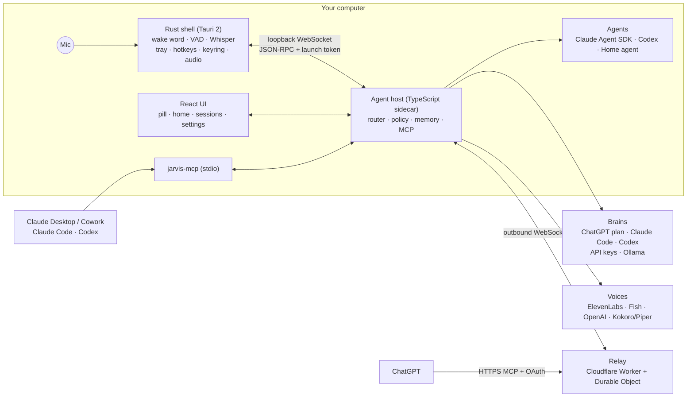

Each utterance goes through a **fast path** first (stop, status, timers, alarms, reminders, time, private mode — no AI, instant). Everything else goes to your chosen **brain**, which returns a validated action: answer now, start or continue a background **session**, ask a clarifying question, set a reminder, or remember something. A **policy layer** checks every action before it runs. Read more in [Architecture overview](docs/architecture/overview.md) and the [ADRs](docs/adr/).

---

## Security model

Jarvis listens to a microphone and can start agents that run commands. The design assumes that **the room, the web and your inbox may try to trick it**. The rules every release must keep ([full model](docs/security-model.md)):

- **Safe by default** — projects start in `Safe`: reading and editing inside the project are allowed; shell, network, deletion outside the project and MCP write tools ask first.
- **Risk-tiered approvals** — `low`/`medium` can be approved by voice; `high` (deletion, `sudo`, credentials, `git push`, publishing, outbound data) needs a click; no answer means **deny**.
- **Inert deep links** — `jarvis://` links only open windows; they can never carry a command.
- **Content is data** — email bodies, web pages and tool output can't create actions; only your own words can.
- **Secrets in the OS keychain only**, never in files, logs or command lines.
- **No silent paid fallback** — subscription caps are reported, never bypassed.
- **Relay hardening** — OAuth plus a pairing secret, read-only by default, rate limited, no inbound ports.

Found a vulnerability? Please follow [SECURITY.md](SECURITY.md) — don't open a public issue.

---

## Privacy

- Wake word, voice activity detection and Whisper transcription run **on your device**.
- Cloud speech recognition is **opt-in** and receives audio only after a command is captured.
- **Private mode** keeps brain, voice and speech local and shows a green ring around the orb.
- History, sessions, reminders and memory live in one SQLite file in your app-data folder; you choose the retention (default 30 days) and can delete today's or all history.
- Memory is always visible and editable; Jarvis forgets by item, never by fuzzy match.
- No telemetry.

More: [Memory & privacy](docs/guides/memory-privacy.md).

---

## Configuration

Everything is in the Settings window (General · Brain & accounts · Agents & projects · Voice · Microphone & wake word · Privacy · Integrations · Shortcuts · About). Some defaults:

| Setting | Default |
|---|---|
| Push-to-talk | `Alt+Space` (⌥Space on macOS) |
| Sessions panel | `Ctrl/⌘+Shift+J` |
| Wake word "Jarvis" | on |
| Conversation mode (keep listening after a reply) | on, 6 s |
| Speech recognition | local Whisper `small` |
| Voice | system voice |
| Project permission level | `Safe` |
| Max parallel sessions | 4 |
| History retention | 30 days |

Every key, type and default: [Settings reference](docs/reference/settings.md).

---

## FAQ

**Is it free?** Jarvis is free and open source. It uses AI services you already have (ChatGPT plan, Claude Code, Codex), API keys you provide, or local models that cost nothing.

**Will it run up an API bill?** Not by surprise. With a subscription it uses your plan allowance, and when a cap is reached it tells you instead of switching to a paid API.

**Does it listen to everything I say?** No. The wake word runs on your computer and nothing is sent anywhere until a command is captured. You can turn the wake word off and use push-to-talk only.

**Can it delete my files?** Not without asking. Deletion outside a project, `sudo`, `git push` and similar actions always need a click.

**Which languages?** English and Italian at launch.

**Why does my OS warn me when I open it?** v0.1 installers aren't code-signed yet. See [Install](#install).

More: [FAQ](docs/guides/faq.md) · [Troubleshooting](docs/guides/troubleshooting.md).

---

## Roadmap

v0.1 "Hello, Jarvis" is out (current: v0.1.2). Next up: a **📱 mobile companion app** (push-to-talk, live sessions, remote approvals, notifications through an end-to-end encrypted Jarvis Link), signed installers, speaker verification and scheduled routines. See [ROADMAP.md](ROADMAP.md).

---

## Contributing

Contributions are welcome — code, docs, translations, testing on your OS. Start with [CONTRIBUTING.md](CONTRIBUTING.md) and the [development setup](docs/contributing/dev-setup.md). Please follow our [Code of Conduct](CODE_OF_CONDUCT.md).

---

## License

[MIT](LICENSE) © Lorenzo Padovani ([@lopadova](https://github.com/lopadova)).

---

## Acknowledgements

Jarvis is built on the shoulders of great open-source projects:

- [Tauri](https://tauri.app) — the cross-platform shell
- [React](https://react.dev), [Vite](https://vite.dev), [Tailwind CSS](https://tailwindcss.com), [Radix UI](https://www.radix-ui.com) / [shadcn/ui](https://ui.shadcn.com), [Motion](https://motion.dev), [Lucide](https://lucide.dev)
- [sherpa-onnx](https://github.com/k2-fsa/sherpa-onnx) — on-device keyword spotting and voice activity detection, with the [Silero VAD](https://github.com/snakers4/silero-vad) model
- [whisper.cpp](https://github.com/ggml-org/whisper.cpp) and OpenAI's [Whisper](https://github.com/openai/whisper) models — local speech recognition
- [Model Context Protocol](https://modelcontextprotocol.io) TypeScript SDK
- [Claude Agent SDK](https://docs.anthropic.com/en/docs/claude-code/sdk) and [Codex](https://github.com/openai/codex)
- [Bun](https://bun.sh), [zod](https://zod.dev), [Vitest](https://vitest.dev), [Biome](https://biomejs.dev)
- [Kokoro](https://huggingface.co/hexgrad/Kokoro-82M) and [Piper](https://github.com/rhasspy/piper) — local voices
- [Ollama](https://ollama.com) — local models
- [Cloudflare Workers](https://workers.cloudflare.com) and `workers-oauth-provider` — the ChatGPT relay
- [Inter](https://rsms.me/inter/) and [JetBrains Mono](https://www.jetbrains.com/lp/mono/) fonts
- [docmd](https://www.npmjs.com/package/@docmd/core) — the documentation site
