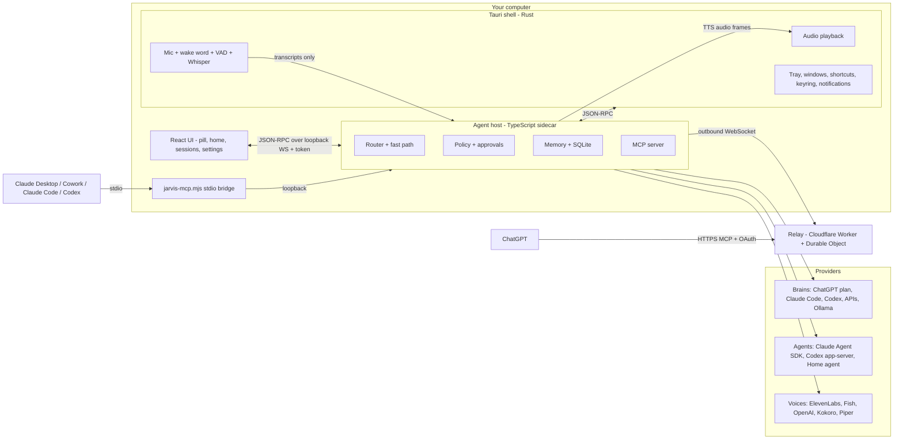
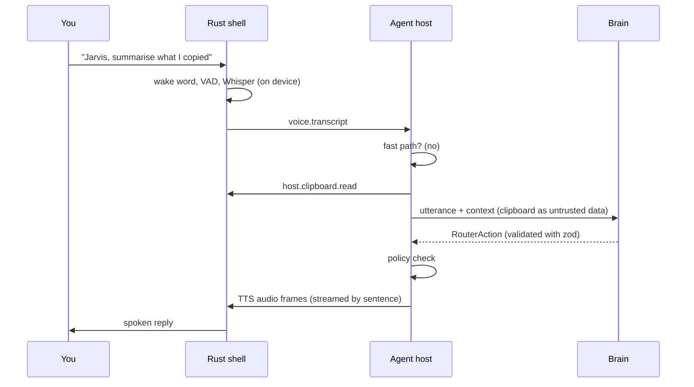

# Architecture overview

Jarvis is a **Tauri 2** app with a thin Rust shell and a **TypeScript sidecar** (`packages/agent-host`,
compiled with Bun into a single binary per platform). The UI is **React 19**. Shared types and pure
logic live in `packages/core`.

## Responsibilities

| Layer | Owns |
|---|---|
| **Rust shell** (`apps/desktop/src-tauri`) | Windows, tray, global shortcuts with press/release, keyring, audio in/out, wake word and VAD (sherpa-onnx), local Whisper, echo cancellation, sidecar supervision, single instance, autostart, deep links (auto-update is off in v0.1) |
| **UI** (`apps/desktop/src`) | Presentational React 19 + Tailwind v4 surfaces: listening pill, sessions panel, home, onboarding, settings |
| **Agent host** (`packages/agent-host`) | Router, fast path, policy and approvals, memory, SQLite, providers registry, agent drivers, MCP server |
| **Core** (`packages/core`) | Pure TypeScript: settings schema, IPC contract, router schema, fast-path intents, risk classification, suggestions, phrases, voice cues |
| **Providers** (`packages/providers`) | Brains, TTS and cloud STT implementations |
| **MCP** (`packages/mcp`) | stdio bridge `jarvis-mcp.mjs`, `.mcpb` manifest, Cowork / Claude Code plugin |
| **Relay** (`packages/relay`) | Remote MCP for ChatGPT on Cloudflare Workers (plus a Vercel variant) |

## A turn, end to end

1. **Capture:** voice activity detection ends the command after ~1.2 s of silence (max 30 s).
2. **Fast path:** stop, status, repeat, time, timers, alarms, reminders, private mode, settings — no AI.
3. **Brain:** the utterance plus context (projects, sessions, memory, recent turns, time, locale) is sent
   to the primary brain, which returns a `RouterAction` validated against a schema.
4. **Policy:** security rules check the action (e.g. tasks must be grounded in your words).
5. **Execute and speak:** answer, spawn or follow up a session, set a reminder; the reply is streamed to
   the voice provider sentence by sentence.

## Router actions

`answer` · `spawn` · `followup` · `cancel` · `status` · `open` · `clarify` · `create_project` ·
`reminder`, with optional `remember` / `forget` side effects.

## IPC

JSON-RPC 2.0 over a **loopback WebSocket**. The shell starts the sidecar with a random 256-bit token in
an environment variable; the sidecar binds `127.0.0.1` on an ephemeral port, prints it once, and closes
any connection without the token or with a browser `Origin`. Three roles connect: `ui`, `shell` and
`mcp`. Raw microphone audio never crosses the boundary.

## Performance targets

| Metric | Target |
|---|---|
| Idle memory (shell + sidecar) | under 80 MB |
| Idle CPU with wake word | under 2 % |
| Wake → listening feedback | under 150 ms |
| Fast-path reply | under 300 ms |
| First audio of a brain reply | under 1.5 s (cloud brain, streaming TTS, good network) |
| Startup to tray | under 2 s |

Deeper dives: [Relay protocol](/architecture/relay-protocol) · [Decisions (ADR)](/architecture/adr) ·
[Security model](/security/model).
