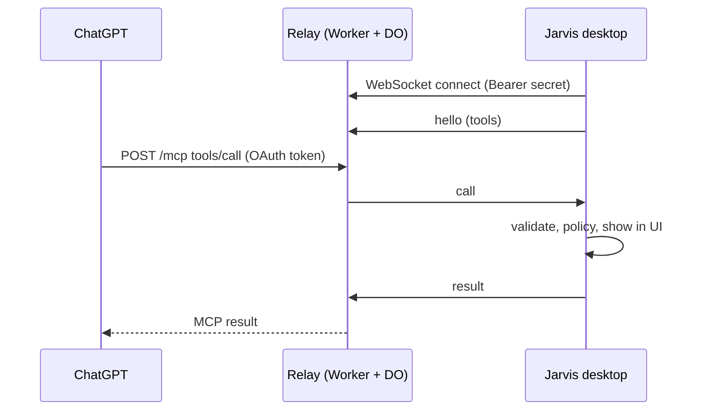

# Relay protocol

The relay is a public HTTPS endpoint that ChatGPT (or any remote MCP client) calls. The desktop never
accepts inbound connections: it keeps **one outbound WebSocket** to the relay, which forwards tool calls
through it. Reference implementation: `packages/relay` (Cloudflare Worker + one Durable Object per paired
desktop). The Vercel variant uses the same messages over long-polling.

## 1. Pairing

::: steps
1. **The desktop generates secrets**
   `pairId` — 16 random bytes, base32-lowercase (26 chars). `secret` — 32 random bytes, base64url. Both
   are stored in the OS keyring.

2. **It registers with the relay**
   `POST /pair/register` with `{ "pairId": "...", "secretHash": "sha256(secret) hex", "label": "Lorenzo's MacBook" }`.
   `201` = registered; `409` = pairId taken, retry with a new one. The relay stores **only the hash**.

3. **It shows a pairing code**
   The first 8 characters of `base32(sha256(secret))`, uppercase, plus a QR code of
   `/connect?pair=PAIR_ID` on the relay.

4. **You type the code in the relay's OAuth page**
   When you add the connector in ChatGPT, the relay's authorize page asks for the code and checks it
   against the stored hash. The OAuth grant is bound to that `pairId`.
:::

## 2. Desktop link (WebSocket)

`GET /desktop/connect?pairId=PAIR_ID` with `Authorization: Bearer SECRET` and `Upgrade: websocket`.
The relay verifies `sha256(secret) == secretHash` and routes the socket to the Durable Object named
after `pairId`. One desktop socket per pair; a newer connection replaces the older one.

| Direction | Message |
|---|---|
| desktop → relay | `{ "type": "hello", "version": "0.1.0", "tools": [ { "name": "jarvis_list_sessions", "readOnly": true } ] }` — tools the desktop exposes (read-only by default) |
| relay → desktop | `{ "type": "call", "id": "uuid", "tool": "jarvis_list_sessions", "args": {}, "client": "chatgpt" }` |
| desktop → relay | `{ "type": "result", "id": "uuid", "ok": true, "content": [ { "type": "text", "text": "..." } ] }` or `{ "type": "result", "id": "uuid", "ok": false, "error": "message" }` |
| either | `{ "type": "ping", "t": 1730000000000 }` → `{ "type": "pong", "t": ... }` every 30 s |

Rules:

- Calls time out after **120 s** on the relay side (`jarvis_ask_user` may legitimately wait).
- With no desktop connected, `tools/call` returns an MCP error result: *"Jarvis is offline on your
  computer"*.
- `tools/list` returns only the tools from the last `hello`, with `readOnlyHint` / `destructiveHint`
  from `McpTools`.
- The desktop re-checks every call: schema validation, permission policy, UI visibility. A relayed call
  can never skip a required local approval.

## 3. Remote MCP endpoint

- `POST /mcp` — MCP Streamable HTTP. Requires `Authorization: Bearer` with an access token issued by the
  relay's OAuth provider (`workers-oauth-provider`).
- Methods: `initialize`, `notifications/initialized`, `ping`, `tools/list`, `tools/call`.
- OAuth metadata at `/.well-known/oauth-authorization-server` and `/.well-known/oauth-protected-resource`;
  dynamic client registration enabled (ChatGPT needs it).

## 4. Limits

- Max frame and argument size: **64 KB**.
- Rate limit: **60 calls per minute** per pair.
- Storage: the pair record (`pairId`, `secretHash`, `label`, `createdAt`) and OAuth grants. **No tool
  arguments or results are persisted.**
