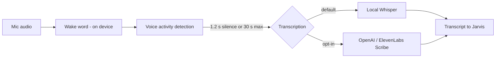

# Microphone & wake word

::: callout tip "The privacy promise" icon:shield-check
The wake word runs **on your computer**. Nothing is sent anywhere until a command has been captured —
and even then, only to a cloud transcription service if you chose one. A visible indicator shows
whenever the microphone is live.
:::

## Ways to wake Jarvis

| Trigger | How | Setting |
|---|---|---|
| **Wake word** | Say "Jarvis" | `wakeWord` (on) |
| **Push-to-talk** | Hold the shortcut, speak, release | `pushToTalk` (`Alt+Space`) |
| **Double clap** | Clap twice, only when idle | `wakeOnClap` (off) |
| **Type or click** | Home composer or a suggestion chip | — |
| **Conversation mode** | After a reply, keep talking without "Jarvis" | `conversationMode` (on), `conversationWindowMs` (6000) |

On macOS the push-to-talk default shows as `⌥Space`. On Windows, `Alt+Space` opens many apps' window
menu — `Ctrl+Alt+Space` is a good choice. Change it in **Settings › Shortcuts** (the recorder warns
about conflicts).

## What happens when you speak

Raw audio never crosses into the app logic: the native shell runs wake word, voice detection and
local transcription and passes on **text only**. Audio is sent to a cloud provider only if you select
one in `stt`.

## Transcription engines

| Engine | Setting `stt` | Privacy | Notes |
|---|---|---|---|
| **Local Whisper** (default) | `local-whisper` | Stays on device | Choose a model size below |
| OpenAI transcribe | `openai` | Audio sent to OpenAI | Needs an OpenAI API key |
| ElevenLabs Scribe | `elevenlabs` | Audio sent to ElevenLabs | Needs an ElevenLabs key |

### Whisper model sizes

| `whisperModel` | Approx. download | Good for |
|---|---|---|
| `tiny` | ~115 MB | Older computers, quick commands |
| `base` | ~210 MB | Light machines |
| `small` (default) | ~640 MB | Best balance, good Italian |
| `medium` | ~1.9 GB | Accents, noisy rooms |
| `large-v3-turbo` | ~565 MB | Highest accuracy on a fast machine |

Speech models (wake word, voice detection, Whisper) are downloaded with **Settings › Microphone & wake
word › Download models** into the `models` folder of the data directory. Local voices (Piper) download on
first use. Sizes are approximate.

## Echo cancellation and barge-in

`echoCancellation` (on) removes Jarvis's own voice from the microphone so you can interrupt it mid-reply.
If Jarvis hears itself on speakers, use headphones or lower the volume.

## Permissions per OS

- **macOS:** System Settings › Privacy & Security › Microphone › Jarvis.
- **Windows:** Settings › Privacy & security › Microphone › allow desktop apps.
- **Linux:** check your PulseAudio/PipeWire input device and that no sandbox blocks it.

Mute the mic from the tray menu at any time. See also [Troubleshooting](/guides/troubleshooting).
