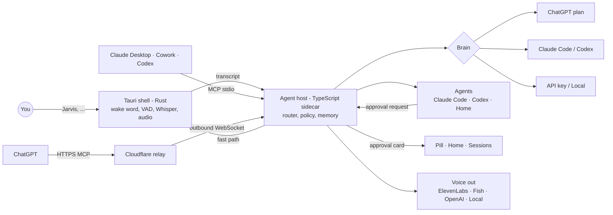

# Jarvis


> **Jarvis is a voice-first assistant for your computer that runs on the AI subscriptions you already
> have.** Say *"Jarvis"*, talk like you would to a colleague, and it answers on the spot — or hands
> real work to Claude Code, Codex or its built-in Home agent, narrates progress, **asks before anything
> risky**, and tells you when it's done. Open source, cross-platform, private by design.

::: callout info "New here? Read this page top to bottom" icon:compass
In five minutes you will know what Jarvis is, what it can do for you on an ordinary day, why it is
different from the assistant that came with your computer, and exactly where to click next. Every other
page goes deeper; this one gives you the whole picture.
:::

---

## What it is — in one minute

Jarvis lives quietly in your menu bar or system tray. When you need it, you say **"Jarvis"**, hold a
shortcut, or click a suggestion — and speak normally.

- **Quick things get answered right away**, out loud: the time, a timer, a reminder, "what did I just
  copy?", "what's on my screen?".
- **Real work is handed to a background agent** — Claude Code, Codex, or Jarvis's own Home agent — which
  can research the web, find files, tidy folders or build a feature in your project, while Jarvis keeps
  you posted in a calm voice.
- **Anything risky waits for you.** Deleting files, running a shell command, sending data somewhere:
  Jarvis shows an approval card and waits for your "yes" — or, for high-risk actions, your click.
- **It uses what you already pay for.** Sign in with your ChatGPT Plus/Pro plan, use your Claude Code or
  Codex subscription, bring an API key, or run fully local models. No surprise bills.

> **In one line:** *a calm, capable voice for your computer that uses your existing AI subscriptions,
> delegates real work to agents, and never does anything risky without asking.*

---

## The problem it solves

| Without Jarvis | With Jarvis |
|---|---|
| The assistant built into your OS sets timers but can't actually *do* work with your files, projects or apps. | Jarvis delegates real work to capable agents (Claude Code, Codex, Home agent) and reports back. |
| AI chat apps live in a browser tab: you copy, paste, switch windows, read long answers. | Speak from anywhere; Jarvis reads your clipboard or screen (when you ask) and answers in a few spoken words. |
| You already pay for ChatGPT or Claude, yet every "AI assistant" asks for *another* API key and bill. | Sign in with ChatGPT, or use Claude Code / Codex subscriptions. Jarvis **never** silently switches to paid API. |
| Coding agents need a terminal and your eyes on the screen to approve every step. | Drive agents hands-free across projects; approve low-risk steps by voice, high-risk ones with a click. |
| Voice assistants stream your microphone to the cloud. | The wake word and transcription run **on your computer**; audio leaves only if you choose a cloud provider. |
| Each tool works alone. | Jarvis plugs **into** Claude Desktop / Cowork and ChatGPT as a tool they can call: speak, ask you, start tasks. |

---

## Who it's for

::: grids
  ::: grid
    ::: card "Everyday users" icon:sun
    No terminal, no API keys. Morning briefings, timers and reminders, "summarise what I copied", dictation into any app, "find the electricity bill PDF", a shopping list — just by talking.
    :::
  :::
  ::: grid
    ::: card "Knowledge workers" icon:briefcase
    Connect your mail and calendar MCP servers and say "summarise my unread mail" or "prepare me for my next meeting". Jarvis drafts, you approve.
    :::
  :::
  ::: grid
    ::: card "Developers" icon:code
    "In project *shop*, add a footer." Drive Claude Code or Codex hands-free across many projects, ask "how's it going?", switch agents, approve steps by voice.
    :::
  :::
  ::: grid
    ::: card "Power users" icon:plug
    Use Jarvis *from* other AI tools: Claude Desktop, Cowork, Claude Code, Codex and ChatGPT can call `jarvis_speak`, `jarvis_ask_user` and `jarvis_start_task`.
    :::
  :::
:::

---

## Why it's different — the moats

::: grids
  ::: grid
    ::: card "Runs on subscriptions you already have" icon:wallet
    **Sign in with ChatGPT** spends your Plus/Pro plan allowance (with a weekly cap *you* set), or use your **Claude Code** or **Codex** subscription. API keys and local models are there when you want them.
    :::
  :::
  ::: grid
    ::: card "Never a surprise bill" icon:badge-check
    When a plan cap is reached, Jarvis tells you and offers alternatives. It **never** switches to a pay-per-use API on its own — this is a tested security rule, not a setting.
    :::
  :::
  ::: grid
    ::: card "Safe by default" icon:shield-check
    New projects start in **Safe** mode. Shell, network, deletions outside the project and write tools need approval. Low/medium risk: say "yes". High risk: a click is required.
    :::
  :::
  ::: grid
    ::: card "Your voice stays on your computer" icon:mic
    The wake word, voice detection and Whisper transcription run on-device. A visible indicator shows when the mic is live. Cloud speech-to-text is opt-in.
    :::
  :::
  ::: grid
    ::: card "Works inside Claude and ChatGPT" icon:blocks
    A one-click `.mcpb` extension for Claude Desktop / Cowork, an MCP server for Claude Code and Codex, and a free Cloudflare relay so ChatGPT can reach Jarvis without opening ports.
    :::
  :::
  ::: grid
    ::: card "Many voices, one personality" icon:audio-lines
    ElevenLabs (expressive v3 or low-latency Flash), Fish Audio, OpenAI, local Kokoro/Piper, or your OS voice. Jarvis adapts its expressive cues to each one.
    :::
  :::
  ::: grid
    ::: card "Tiny and cross-platform" icon:feather
    Tauri 2 + a compact TypeScript sidecar: a target of under 80 MB of RAM while idle, a few-MB installer, native on macOS, Windows and Linux.
    :::
  :::
  ::: grid
    ::: card "Private mode in one sentence" icon:lock
    "Jarvis, switch to local mode." A green ring tells you nothing leaves this computer: local brain, local voice, local transcription.
    :::
  :::
  ::: grid
    ::: card "Open source, MIT" icon:github
    Read the code, audit the security model (every rule has an automated test), contribute. English and Italian from day one.
    :::
  :::
:::

---

## See it

::: callout tip "Screenshots arrive with v0.1.0" icon:camera
Jarvis is being built in the open. Real screenshots and a short demo video will land here with the first
release. Until then, here is what you will see.
:::

Jarvis has three main surfaces:

- **The listening pill** — a small floating bar at the top of your screen with a luminous **orb**. The
  orb breathes when idle, follows your voice while listening, swirls while thinking and pulses while
  speaking. A thin green ring means *private mode*; an amber halo means *I need your OK*.
- **Home** — a chat-style window with **suggestion chips** ("Morning briefing", "Summarise what I
  copied", "Tidy my Downloads"…) — click one, or just say it.
- **The sessions panel** — live cards for background work: which agent, which project, what it is doing
  right now, and buttons to open the result, read the log, reply or stop.

An approval looks like this:

```text
┌───────────────────────────────────────────────────────────┐
│ ●  Claude · project shop                     risk: MEDIUM │
│    Run a shell command                                    │
│    $ pnpm add -D @fontsource-variable/inter               │
│    in ~/Projects/shop                                     │
│                                                           │
│  [ Allow once ]  [ Deny ]  [ Always allow in this project ]│
│  Say "yes" to allow                                       │
└───────────────────────────────────────────────────────────┘
```

High-risk requests (for example `git push` or deleting files outside the project) drop the voice hint and
the "always allow" button: **click to confirm**.

---

## Jarvis vs the alternatives

| Capability | **Jarvis** | OS built-in assistants | AI chat apps | CLI-only coding agents |
|---|:---:|:---:|:---:|:---:|
| Hands-free wake word on desktop | ✅ | ✅ | ➖ | ❌ |
| Delegates real work to background agents | ✅ | ❌ | ➖ | ✅ |
| Uses your existing ChatGPT / Claude / Codex subscription | ✅ | ❌ | ✅ | ✅ |
| Never switches to pay-per-use silently | ✅ | ➖ | ✅ | ➖ |
| Risk-tiered approvals by voice or click | ✅ | ❌ | ❌ | ➖ |
| On-device wake word + transcription | ✅ | ➖ | ❌ | ❌ |
| Fully local mode (brain + voice) | ✅ | ❌ | ❌ | ➖ |
| Callable from Claude Desktop / Cowork and ChatGPT | ✅ | ❌ | ❌ | ➖ |
| Same app on macOS, Windows and Linux | ✅ | ❌ | ➖ | ✅ |
| Open source | ✅ | ❌ | ❌ | ➖ |

> Legend: ✅ built-in · ➖ partial, depends on the product, or needs extra setup · ❌ not available.
> Built-in assistants are excellent at system controls and smart-home devices; chat apps have the richest
> conversations; CLI agents are the most powerful coders. Jarvis connects these strengths through voice.

---

## How it fits together



Rust handles everything close to the hardware (microphone, wake word, keyring, windows); the TypeScript
sidecar owns the product logic and talks to the official AI SDKs. They speak JSON-RPC over a
token-protected loopback socket. [Read the architecture →](/architecture/overview)

---

## Start in 30 seconds

::: steps
1. **Download Jarvis**
   Grab the installer for your system from the
   [latest release](https://github.com/lopadova/jarvis-desktop/releases/latest). v0.1 builds are
   unsigned, so the first launch needs one extra click — [here's how](/get-started/install).

2. **Pick your brain**
   In the welcome wizard choose **Continue with ChatGPT**, **Use Claude Code**, an **API key** or
   **Run locally**. You can connect several and mark one as primary.

3. **Say hello**
   Say *"Jarvis, what time is it?"* — then try *"Jarvis, summarise what I copied"* or
   *"Jarvis, good morning"*.
:::

Not comfortable installing apps? Paste the repository link into ChatGPT or Claude and say
*"install Jarvis for me"* — it will walk you through it. [How that works →](/get-started/install-with-ai)

**[→ Quickstart](/get-started/quickstart)** · **[→ What Jarvis can do](/everyday/features)** · **[→ Brains & subscriptions](/guides/brains)**

---

## Where to go next

::: grids
  ::: grid
    ::: card "Everyday features" icon:sun
    Briefings, timers, clipboard magic, dictation, screen questions, files, research, memory. **[Explore →](/everyday/features)**
    :::
  :::
  ::: grid
    ::: card "Brains & subscriptions" icon:brain
    ChatGPT plan, Claude Code, Codex, API keys, Ollama — and the honest limits of each. **[Choose →](/guides/brains)**
    :::
  :::
  ::: grid
    ::: card "Permissions & approvals" icon:shield-check
    Safe, Trusted and Full auto; risk tiers; what you can approve by voice. **[Learn →](/guides/permissions)**
    :::
  :::
  ::: grid
    ::: card "Developers & agents" icon:code
    Projects, sessions, follow-ups and hands-free Claude Code / Codex. **[Build →](/developers/agents)**
    :::
  :::
  ::: grid
    ::: card "Inside Claude & ChatGPT" icon:blocks
    Install the `.mcpb` extension or deploy the free relay. **[Connect →](/integrations/cowork-claude-desktop)**
    :::
  :::
  ::: grid
    ::: card "Security model" icon:shield
    Threats, the twelve rules every release must keep, and how they are tested. **[Audit →](/security/model)**
    :::
  :::
:::

::: callout tip "Project facts" icon:info
**License** MIT · **Stack** Tauri 2 (Rust) + React 19 + TypeScript sidecar (Bun-compiled) ·
**Platforms** macOS, Windows, Linux · **Languages** English, Italian · **Status** v0.1 in progress
(installers unsigned) · [GitHub](https://github.com/lopadova/jarvis-desktop) ·
[Releases](https://github.com/lopadova/jarvis-desktop/releases) ·
[Roadmap](https://github.com/lopadova/jarvis-desktop/blob/main/ROADMAP.md)
:::
