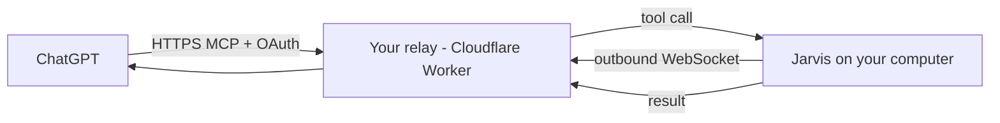

# ChatGPT

ChatGPT can only connect to **remote HTTPS** MCP servers, while Jarvis runs on your computer — often
behind a router, and it never opens inbound ports. The solution is a tiny **relay** that you own:



Jarvis keeps one **outbound** connection to the relay; ChatGPT calls the relay; the relay forwards the
call through that connection. Nothing reaches your computer unless Jarvis dialled out first.

::: tabs
== tab "Cloudflare (recommended)"
Free tier, one click, lowest latency. The default Worker name is `jarvis-relay`.

[](https://deploy.workers.cloudflare.com/?url=https://github.com/lopadova/jarvis-desktop/tree/main/packages/relay)

Or from a clone of the repo:
```bash
cd packages/relay
pnpm install
pnpm exec wrangler deploy
```

Then:
1. In **Jarvis › Settings › Integrations › ChatGPT**, paste your relay URL
   (`https://jarvis-relay.YOUR-ACCOUNT.workers.dev`) and click **Pair**. Jarvis shows a QR code and an
   8-character **pairing code**.
2. In ChatGPT, add a custom connector (in the connectors / apps settings) with the URL
   `https://jarvis-relay.YOUR-ACCOUNT.workers.dev/mcp`.
3. ChatGPT opens the relay's sign-in page: type the **pairing code**. Done.

== tab "Vercel"
For people who already use Vercel. Vercel Functions cannot hold a WebSocket, so the desktop
**long-polls** a queue on Upstash Redis (free tier). It works, with a bit more latency. Deploy the
Vercel variant described in `packages/relay` and set the Upstash credentials as environment variables,
then pair exactly as with Cloudflare.

== tab "Cloudflare Tunnel"
No relay code: `cloudflared` exposes Jarvis's local MCP HTTP endpoint directly through a free tunnel.
You must turn on authentication. Step-by-step:
[ChatGPT via Cloudflare Tunnel](https://github.com/lopadova/jarvis-desktop/blob/main/docs/guides/chatgpt-tunnel.md).
:::

## What ChatGPT can do

By default the relay exposes only **read-only** tools: `jarvis_list_sessions`, `jarvis_session_result`,
`jarvis_recall`. To let ChatGPT speak, ask you questions or start tasks, enable **Expose write tools** in
**Settings › Integrations** (`relayExposeWriteTools`). Even then, high-risk steps need a click on your
computer.

## Security, in short

- **OAuth + pairing secret:** only a ChatGPT account that typed your pairing code can call your relay.
  The relay stores only a **hash** of the secret.
- **Everything is visible:** each relayed call appears in the Jarvis UI.
- **Nothing is stored:** the relay keeps the pairing record and OAuth grants — never tool arguments or
  results.
- **Limits:** 64 KB per message, 60 calls per minute, 120 s timeout. If Jarvis is closed ChatGPT gets
  *"Jarvis is offline on your computer"*.

::: callout warning "Plan limitations — be aware" icon:triangle-alert
Which ChatGPT plans can add custom MCP connectors, and whether write actions are allowed on Plus/Pro,
is decided by OpenAI and changes over time. Check the current OpenAI documentation for your plan
before you deploy. This is separate from **Sign in with ChatGPT**, which lets Jarvis *use* your plan as
its brain.
:::

Protocol details: [Relay protocol](/architecture/relay-protocol).
