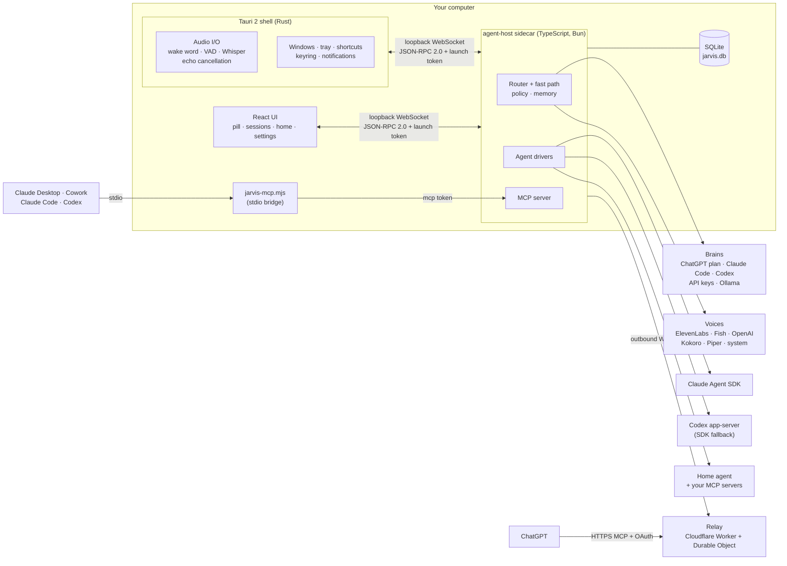
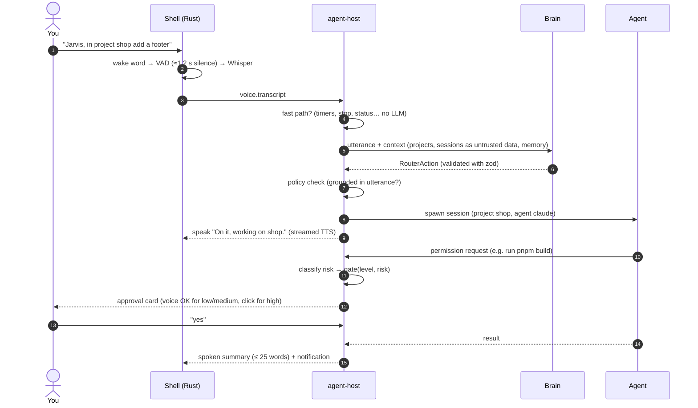

# Architecture overview

Jarvis is a **Tauri 2 shell** (Rust) with a **React 19** UI and a **TypeScript sidecar** (`agent-host`, compiled to a single binary with Bun). Rust does what must be native and fast — audio, wake word, windows, keyring. TypeScript does the product logic with the official AI SDKs. Why: [ADR 0001](../adr/0001-stack-tauri2-typescript.md).

## Big picture

## Processes and boundaries

| Process | Language | Owns |
|---|---|---|
| **Shell** (`apps/desktop/src-tauri`) | Rust | Windows (frameless, glass/solid), tray, global shortcuts with press/release, keyring, audio capture/playback, wake word + VAD (sherpa-onnx), Whisper (whisper.cpp), echo cancellation, clap detection, single instance, autostart, deep links (the updater plugin is present but auto-update is off in v0.1), sidecar supervision |
| **UI** (`apps/desktop/src`) | React 19 + TS | Presentational surfaces: listening pill, sessions panel, home, onboarding, settings |
| **Sidecar** (`packages/agent-host`) | TypeScript (Bun binary) | Router, fast path, providers, agent drivers, approvals, memory, history, reminders, MCP server, relay link |
| **MCP bridge** (`jarvis-mcp.mjs`) | TypeScript | Stdio MCP server launched by Claude/Codex; forwards to the sidecar |
| **Relay** (`packages/relay`) | TypeScript (Worker) | Remote HTTPS MCP endpoint for ChatGPT; forwards through the desktop's outbound socket |

### IPC (ADR 0002)

- The shell spawns the sidecar with a random 256-bit token in the `JARVIS_LAUNCH_TOKEN` **environment variable** (never argv).
- The sidecar binds `127.0.0.1:<ephemeral>`, prints `JARVIS_READY <port>` once, and accepts only connections presenting the token, with an `Origin` check against browsers and DNS rebinding.
- Messages are JSON-RPC 2.0 with zod schemas in `packages/core/src/ipc.ts`. Roles: `ui` (calls `app.*`, receives `ui.*`), `shell` (sends `voice.*`, serves `host.*`), `mcp` (calls `mcp.call`).
- Raw microphone audio stays in Rust; only transcripts cross the boundary (plus captured command audio when a cloud STT is enabled). TTS audio flows sidecar → shell as binary frames.
- Local MCP bridges find the sidecar through `run/agent-host.json` (owner-only), whose token authorises **only** the `mcp` role.

Details: [ADR 0002](../adr/0002-sidecar-ipc.md).

## A turn, end to end

The router's output contract (`RouterAction`: `answer`, `spawn`, `followup`, `cancel`, `status`, `open`, `clarify`, `create_project`, `reminder`, plus `remember` / `forget`) is defined in the [product spec](../product-spec.md#5-routeraction-schema-contract).

## Packages

| Path | Purpose |
|---|---|
| `apps/desktop` | Tauri 2 app: Rust shell (`src-tauri`) and React UI (`src`) |
| `packages/core` | Shared pure TypeScript: settings, IPC contract, `McpTools`, router schema and prompt, fast path, risk policy, suggestions, phrases, voice cues, paths. Reusable by a future mobile companion. |
| `packages/agent-host` | The sidecar: router, memory, policy, agent drivers, MCP server |
| `packages/providers` | Brains, TTS and cloud STT implementations |
| `packages/mcp` | `jarvis-mcp.mjs` stdio/HTTP server, `.mcpb` manifest, Cowork / Claude Code plugin |
| `packages/relay` | Remote MCP relay for ChatGPT (Cloudflare Worker + Durable Object; Vercel variant) |
| `docs/`, `docs-site/` | Markdown docs and the docmd documentation site |

## Security architecture

Safe-by-default permission levels, risk-tiered approvals, inert deep links, "content is data", keyring-only secrets, process-group supervision and relay hardening are specified in the [security model](../security-model.md) (rules R1–R12, each with an automated test) and [ADR 0003](../adr/0003-permission-model.md).

## Decisions

- [ADR 0001 — Tauri 2 shell + TypeScript sidecar](../adr/0001-stack-tauri2-typescript.md)
- [ADR 0002 — Sidecar IPC](../adr/0002-sidecar-ipc.md)
- [ADR 0003 — Permission model](../adr/0003-permission-model.md)
- [ADR 0004 — Sign in with ChatGPT](../adr/0004-sign-in-with-chatgpt.md)
- [ADR 0005 — ChatGPT relay](../adr/0005-chatgpt-relay.md)
- [Relay protocol](relay-protocol.md)
