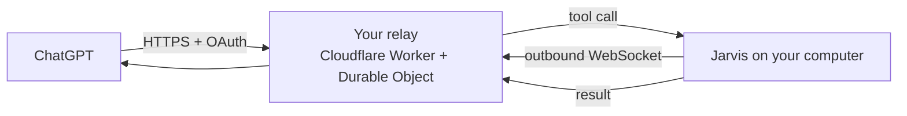

# Use Jarvis from ChatGPT

ChatGPT can only connect to **remote HTTPS** MCP servers, while Jarvis runs on your computer — usually behind a home router, with no public address. Jarvis solves this with a small **relay** that you deploy for free. Your computer never opens an inbound port: it keeps one **outbound** WebSocket to the relay, and the relay forwards ChatGPT's tool calls through it.



## Before you start: what to expect

- **Plan availability:** custom MCP connectors in ChatGPT, developer mode and write actions depend on your ChatGPT plan and on OpenAI's current rollout. **Check the current OpenAI docs** before you start; menu names change.
- By default only **read-only** tools are exposed to ChatGPT (`jarvis_list_sessions`, `jarvis_session_result`, `jarvis_recall`). Write tools (speak, ask, notify, start task, remember) are hidden unless you turn on **Expose write tools** (`relayExposeWriteTools`).
- **High-risk actions still need a local click** on your computer. A relayed call can never skip an approval.
- Every relayed call is **shown in the Jarvis UI**.
- If Jarvis is offline, ChatGPT gets the answer "Jarvis is offline on your computer".

## Option A — Cloudflare relay (recommended, free tier)

Uses Cloudflare Workers + Durable Objects (with WebSocket hibernation, which keeps it within the free tier).

### 1. Deploy

One click:

[](https://deploy.workers.cloudflare.com/?url=https://github.com/lopadova/jarvis-desktop/tree/main/packages/relay)

Or from a clone of the repository:

```bash
cd packages/relay
pnpm install
pnpm exec wrangler deploy
```

You'll get a URL like `https://jarvis-relay.<your-account>.workers.dev`.

### 2. Pair Jarvis with your relay

1. Jarvis › Settings › Integrations › **ChatGPT**.
2. Paste the relay URL and click **Pair**.
3. Jarvis registers with the relay (only a hash of its secret is stored there) and shows a **pairing code** (8 characters) and a QR code.

### 3. Add the connector in ChatGPT

1. In ChatGPT settings, enable **developer mode** for connectors (if your plan requires it) and **create a custom connector**.
2. URL: `https://jarvis-relay.<your-account>.workers.dev/mcp`, authentication **OAuth**.
3. ChatGPT opens the relay's authorisation page: enter the **pairing code** shown in Jarvis.
4. In a chat, enable the Jarvis connector and ask: *"What is Jarvis working on?"*

## Option B — Vercel (free tier)

Vercel Functions cannot keep WebSockets open, so in this variant Jarvis **long-polls** a queue stored in Upstash Redis (free tier). It works, with higher latency. Deployment steps are in `packages/relay` (Vercel variant); pairing and the ChatGPT side are the same as above.

## Option C — Cloudflare Tunnel (no code)

If you already use `cloudflared`, you can expose Jarvis's local MCP HTTP endpoint directly through a tunnel instead of deploying a relay. You **must** keep authentication on. Step-by-step instructions: [chatgpt-tunnel.md](chatgpt-tunnel.md).

## Security details

| Protection | How |
|---|---|
| No inbound ports | Outbound WebSocket only. |
| Two locks | OAuth for ChatGPT **and** a desktop pairing secret. The relay stores only a hash. |
| Least privilege | Read-only tools by default; destructive tools disabled on the relay. |
| Local re-check | Jarvis validates every call, applies the permission policy and shows it in the UI. |
| No storage of content | The relay stores the pairing record and OAuth grants only — **no tool arguments or results**. |
| Limits | 60 calls per minute per pairing; calls time out after 120 s; 64 KB max message size. |

Unpair at any time in Settings › Integrations › ChatGPT; the relay then rejects the old secret.

The wire protocol is documented in [relay-protocol.md](../architecture/relay-protocol.md).
